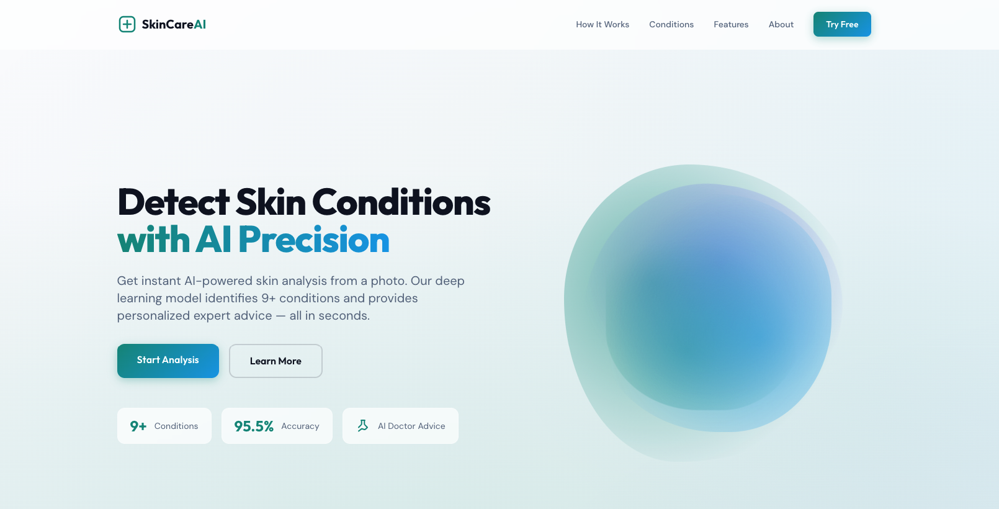

# SkinCare AI — Intelligent Skin Disease Detection



An AI-powered web application that detects and classifies **9 common skin conditions** using a dual-approach architecture — combining a locally-trained **PyTorch EfficientNet-B0** deep learning model with **Google Gemini Vision API** for intelligent diagnosis and personalized dermatological advice.

I built this as a full-stack SaaS application from the ground up: trained the computer vision model, designed the hybrid prediction pipeline, developed the Flask backend, and crafted a modern responsive frontend — all containerized with Docker for easy deployment.

### Video Demo

[](https://www.awesomescreenshot.com/video/50273742?key=c345bfaac98e052bd7f1388c268a91fe)

> Click the image above to watch the full demo, or [click here](https://www.awesomescreenshot.com/video/50273742?key=c345bfaac98e052bd7f1388c268a91fe).

---

## Computer Vision Architecture

```
┌─────────────────────────────────────────────────────────────────────────────┐
│                        SKINCARE AI — SYSTEM ARCHITECTURE                    │
└─────────────────────────────────────────────────────────────────────────────┘

                              ┌──────────────┐
                              │  User Upload  │
                              │  (Image File) │
                              └──────┬───────┘
                                     │
                                     ▼
                          ┌─────────────────────┐
                          │    Flask Backend     │
                          │    POST /predict     │
                          │                      │
                          │  • Validate file     │
                          │  • Save temporarily  │
                          │  • Load as PIL Image │
                          └──────────┬──────────┘
                                     │
                        ┌────────────┴────────────┐
                        │                         │
                        ▼                         ▼
          ┌──────────────────────┐  ┌──────────────────────────┐
          │   APPROACH 1         │  │   APPROACH 2              │
          │   PyTorch Local      │  │   Gemini Vision API       │
          │                      │  │                            │
          │  ┌────────────────┐  │  │  ┌──────────────────────┐ │
          │  │ Preprocessing  │  │  │  │ Image → Base64 JPEG  │ │
          │  │ Resize 512×512 │  │  │  │ + Classification     │ │
          │  │ ToTensor()     │  │  │  │   Prompt              │ │
          │  └───────┬────────┘  │  │  └──────────┬───────────┘ │
          │          │           │  │             │              │
          │          ▼           │  │             ▼              │
          │  ┌────────────────┐  │  │  ┌──────────────────────┐ │
          │  │ EfficientNet-  │  │  │  │  Gemini 2.5 Flash    │ │
          │  │ B0 Model       │  │  │  │  Vision Model        │ │
          │  │ (11M params)   │  │  │  │  (Multimodal LLM)    │ │
          │  └───────┬────────┘  │  │  └──────────┬───────────┘ │
          │          │           │  │             │              │
          │          ▼           │  │             ▼              │
          │  ┌────────────────┐  │  │  ┌──────────────────────┐ │
          │  │ Softmax →      │  │  │  │ Parse response →     │ │
          │  │ Class + Conf%  │  │  │  │ Match to 9 classes   │ │
          │  └────────────────┘  │  │  └──────────────────────┘ │
          │                      │  │                            │
          │  Always runs (for    │  │  Primary (if API key       │
          │  confidence score)   │  │  available)                │
          └──────────┬───────────┘  └─────────────┬─────────────┘
                     │                            │
                     └────────────┬───────────────┘
                                  │
                                  ▼
                     ┌─────────────────────────┐
                     │   Prediction Result      │
                     │                          │
                     │  • condition: "Acne"     │
                     │  • confidence: 87.5%     │
                     │  • source: "gemini" or   │
                     │            "local-model"  │
                     └────────────┬────────────┘
                                  │
                                  ▼
                     ┌─────────────────────────┐
                     │   AI Advice Engine       │
                     │   POST /advice           │
                     │   Gemini 2.5 Flash       │
                     │                          │
                     │  Generates detailed      │
                     │  clinical report:        │
                     │  • Assessment            │
                     │  • Causes & Triggers     │
                     │  • Medications + Dosages │
                     │  • Clinical Procedures   │
                     │  • Daily Skincare Routine│
                     │  • Diet Recommendations  │
                     │  • Prevention Tips       │
                     │  • Red Flags / Warnings  │
                     └────────────┬────────────┘
                                  │
                                  ▼
                     ┌─────────────────────────┐
                     │   Frontend Display       │
                     │                          │
                     │  • Diagnosis Card        │
                     │  • Confidence Bar        │
                     │  • AI Advice Panel       │
                     │  • PDF Report Download   │
                     └─────────────────────────┘
```

---

## Two Approaches — Why a Hybrid Model?

### Approach 1: PyTorch EfficientNet-B0 (Local Deep Learning)

A custom-trained **EfficientNet-B0** convolutional neural network that runs entirely on the server — no external API calls needed.

**How it works:**
1. Input image resized to **512x512** pixels and converted to a tensor
2. Passed through EfficientNet-B0 (pre-trained on ImageNet, fine-tuned on skin data)
3. **First 7 layers frozen** (transfer learning) — remaining layers trained on skin conditions
4. Softmax output → probability distribution across all 9 classes
5. Highest probability = predicted condition + confidence score

| Parameter | Value |
|-----------|-------|
| Architecture | EfficientNet-B0 |
| Trainable Parameters | ~11 Million |
| Pre-trained On | ImageNet |
| Optimizer | SGD (lr=0.01, momentum=0.9) |
| Loss Function | Categorical Cross-Entropy |
| Test Accuracy | **95.5%** |
| Input Size | 512 x 512 px |

**Benefits:**
- **Fast** — runs locally in milliseconds, no network latency
- **Always available** — works offline with zero API dependency
- **Free** — no per-request costs
- **Consistent** — deterministic output for the same input
- **Private** — images never leave the server

---

### Approach 2: Google Gemini Vision API (Cloud AI)

**Gemini 2.5 Flash** multimodal model serves as the primary classifier — analyzing skin images with vision understanding far beyond pattern matching — and generates detailed clinical advice.

**How it works:**
1. Image converted to **base64 JPEG** and sent to Gemini's vision endpoint
2. Engineered prompt constrains classification to the 9 known conditions
3. Separate advice prompt instructs Gemini to act as a senior dermatologist — producing a structured clinical report with medications, routines, and prevention

**Benefits:**
- **Intelligent** — understands context, severity, and nuance
- **Detailed explanations** — personalized medical advice with dosages
- **Adaptable** — handles edge cases and ambiguous presentations
- **Rich output** — clinical procedures, daily routines, diet recommendations
- **Evolving** — benefits from Google's model updates automatically

---

### Approach 3: YOLOv8 Object Detection (Localization)

I also trained a **YOLOv8 Medium** object detection model that goes beyond classification — it draws **bounding boxes** around affected skin areas, showing exactly *where* and *how much* of the skin is impacted. This is critical for clinical assessment.

The full training pipeline lives in [`Yolo model Implementation/`](Yolo%20model%20Implementation/) — a Jupyter notebook with all training outputs, confusion matrices, and test predictions preserved.

**How it works:**
1. Image resized to **800x800** and passed through the YOLOv8m backbone (CSPDarknet)
2. Multi-scale feature extraction at 3 levels (P3/P4/P5) for small, medium, and large lesions
3. Feature Pyramid Network (FPN) + PANet fuses features across scales
4. Anchor-free detection head predicts bounding boxes, objectness, and class probabilities
5. Non-Maximum Suppression filters duplicate detections

**YOLOv8m Detection Pipeline:**
```
  Input (800×800)
        │
        ▼
  ┌──────────────────────┐
  │  BACKBONE (CSPDarknet)│    Feature extraction at 3 scales
  │  P3 (80×80) — small  │
  │  P4 (40×40) — medium │
  │  P5 (20×20) — large  │
  └──────────┬───────────┘
             │
             ▼
  ┌──────────────────────┐
  │  NECK (PANet + FPN)   │    Fuses multi-scale features
  │  Top-down + Bottom-up │    via bidirectional pathways
  └──────────┬───────────┘
             │
             ▼
  ┌──────────────────────┐
  │  HEAD (Anchor-Free)   │    Per grid cell predicts:
  │  • Bounding box (x,y, │    box coords + objectness
  │    w,h)               │    + 11 class probabilities
  │  • Class scores       │
  └──────────┬───────────┘
             │
             ▼
  ┌──────────────────────┐
  │  NMS (Post-process)   │    Removes duplicate detections
  │  conf threshold: 0.25 │    keeps highest confidence
  └──────────┬───────────┘
             │
             ▼
  Bounding boxes + labels + confidence scores
```

**Model Specs:**

| Parameter | Value |
|-----------|-------|
| Architecture | YOLOv8m (Medium) |
| Parameters | 25.8 Million |
| Layers | 218 (fused) |
| GFLOPs | 78.7 |
| Epochs | 80 |
| Input Size | 800 x 800 px |
| GPU Used | 2x Tesla T4 (Kaggle) |
| Framework | Ultralytics 8.2.85, PyTorch 2.4.0, CUDA 12.4 |
| Inference Speed | **31.4ms/image** |

**Per-Class Validation Results** (264 images, 863 instances):

| Class | mAP50 | Precision | Recall |
|-------|:-----:|:---------:|:------:|
| Acne | 0.485 | 0.602 | 0.448 |
| Chickenpox | 0.176 | 0.449 | 0.149 |
| Eczema | **0.752** | 0.588 | 0.807 |
| Monkeypox | 0.499 | 0.659 | 0.438 |
| Pimple | 0.085 | 1.000 | 0.000 |
| Psoriasis | **0.939** | 0.651 | 0.941 |
| Ringworm | **0.818** | 0.464 | 0.933 |
| Basal Cell Carcinoma | 0.244 | 0.376 | 0.192 |
| Tinea Versicolor | 0.485 | 0.567 | 0.475 |
| Vitiligo | 0.193 | 0.317 | 0.333 |
| Warts | 0.426 | 0.430 | 0.542 |
| **Overall** | **0.464** | **0.555** | **0.478** |

Best performing: **Psoriasis** (93.9% mAP50), **Ringworm** (81.8%), **Eczema** (75.2%) — conditions with distinct visual patterns that YOLO picks up well.

**Training artifacts generated:**
- `confusion_matrix.png` — per-class detection accuracy and misclassifications
- `results.png` — loss curves, precision, recall, mAP over 80 epochs
- `F1_curve.png`, `PR_curve.png`, `P_curve.png`, `R_curve.png` — detailed metric curves
- `val_batch*_pred.jpg` — validation predictions with bounding boxes drawn
- `best.pt` — final trained weights for deployment

**Benefits:**
- **Localization** — shows *where* the condition is, not just *what* it is
- **Multi-detection** — can find multiple conditions in a single image
- **Spatial analysis** — bounding boxes reveal severity and spread
- **Real-time capable** — 31ms inference on Tesla T4
- **11 classes** — detects 2 more conditions than the main app (Chickenpox, Monkeypox, Basal Cell Carcinoma, Pimple added)

> See the full notebook with training outputs, confusion matrices, and test predictions: [`Yolo model Implementation/yolo_v8_skin_disease_detection.ipynb`](Yolo%20model%20Implementation/yolo_v8_skin_disease_detection.ipynb)

---

### Head-to-Head Comparison

| Feature | EfficientNet-B0 (Local) | Gemini (Cloud) | YOLOv8m (Detection) |
|---------|:-:|:-:|:-:|
| **Task** | Classification | Classification + Advice | Detection + Localization |
| **Speed** | ~50ms | ~2-3s | ~31ms |
| **Works Offline** | Yes | No | Yes |
| **Cost** | Free | Pay-per-request | Free |
| **Output** | Class + Confidence | Class + Clinical Report | Bounding Boxes + Labels |
| **Privacy** | Images stay local | Sent to Google | Images stay local |
| **Multi-detection** | No (single label) | No (single label) | Yes (multiple regions) |
| **Explanation** | None | Detailed clinical report | Visual localization |
| **Parameters** | 11M | N/A (API) | 25.8M |

> **Three approaches, three strengths:** EfficientNet gives fast, reliable classification. Gemini adds intelligent context and clinical advice. YOLOv8 provides spatial localization showing exactly where conditions appear on the skin.

---

## Conditions Detected

| # | Condition | Description |
|---|-----------|-------------|
| 1 | **Acne** | Inflammatory condition with pimples, blackheads, and whiteheads |
| 2 | **Acne Scars** | Permanent textural changes left after acne heals |
| 3 | **Acanthosis Nigricans** | Dark, velvety patches in body folds and creases |
| 4 | **Alopecia Areata** | Autoimmune condition causing patchy hair loss |
| 5 | **Dry Skin** | Rough, flaky skin lacking moisture |
| 6 | **Melasma** | Brown/gray-brown patches, usually on the face |
| 7 | **Oily Skin** | Excess sebum production causing shiny, greasy skin |
| 8 | **Vitiligo** | Loss of skin pigment causing white patches |
| 9 | **Warts** | Small, rough growths caused by HPV |

---

## Tech Stack

| Layer | Technology |
|-------|-----------|
| **Backend** | Python 3.10, Flask |
| **Deep Learning** | PyTorch, TorchVision, EfficientNet-B0, YOLOv8 (Ultralytics) |
| **Cloud AI** | Google Gemini 2.5 Flash (Vision + Text) |
| **Image Processing** | Pillow (PIL) |
| **Frontend** | Tailwind CSS v4, Vanilla JS |
| **Animations** | AOS.js (scroll animations) |
| **PDF Export** | html2pdf.js |
| **Infrastructure** | Docker, Docker Compose |

---

## Features

- **Drag & Drop Upload** — drop an image or browse to upload
- **Dual AI Analysis** — local CNN model + Gemini Vision working together
- **Confidence Score** — visual bar with color-coded thresholds (green/amber/red)
- **AI Dermatologist Advice** — detailed clinical report with medications, routines, and prevention
- **PDF Report Download** — export your complete analysis as a professional PDF
- **Responsive Design** — works seamlessly on desktop, tablet, and mobile
- **Modern Landing Page** — clean SaaS-style marketing page with scroll animations

---

## Getting Started

### Prerequisites

- Python 3.10+
- The trained model file `skin-model-pokemon.pt` (place in project root)
- Google Gemini API key *(optional — for enhanced AI features)*

### Local Setup

```bash
# Clone the repository
git clone https://github.com/your-username/skincare-ai.git
cd skincare-ai

# Create virtual environment
python -m venv venv
source venv/bin/activate  # Windows: venv\Scripts\activate

# Install dependencies
pip install -r requirements.txt

# Configure environment
cp .env.example .env
# Edit .env → add your GOOGLE_API_KEY

# Run
python run.py
```

App available at **http://localhost:5000**

### Docker

```bash
docker-compose up --build
# App available at http://localhost:8000
```

### Environment Variables

| Variable | Required | Description |
|----------|:--------:|-------------|
| `GOOGLE_API_KEY` | Optional | Gemini API key for enhanced AI diagnosis + advice |
| `FLASK_DEBUG` | Optional | `true` for development mode |

> The app works without a Gemini API key — it falls back to the local PyTorch model. Advice generation requires the API key.

---

## Project Structure

```
skincare-ai/
├── app/
│   ├── __init__.py            # App init, model loading, class definitions
│   ├── routes.py              # API endpoints, prediction logic, advice generation
│   ├── static/
│   │   ├── js/main.js         # Upload, analysis, markdown parsing, PDF export
│   │   ├── images/            # Static condition images
│   │   └── uploads/           # Temporary upload storage (gitignored)
│   └── templates/
│       ├── base.html          # Base template, Tailwind config, global styles
│       ├── landing.html       # Marketing landing page (8 sections)
│       └── app.html           # Analysis app (upload → results → advice)
├── Yolo model Implementation/
│   ├── yolo_v8_skin_disease_detection.ipynb  # YOLOv8 training notebook
│   └── README.md              # YOLO approach documentation
├── run.py                     # Entry point
├── requirements.txt           # Python dependencies
├── Dockerfile                 # CPU-optimized container
├── docker-compose.yml         # Docker orchestration
├── .env.example               # Environment template
└── .gitignore
```

---

## How It Works

1. **Upload** — drag-and-drop or browse for a skin image
2. **Predict** — image processed through local EfficientNet-B0 (confidence) + Gemini Vision (classification)
3. **Diagnose** — Gemini generates a comprehensive clinical report as an AI dermatologist
4. **Report** — view diagnosis, confidence score, detailed advice, and download as PDF

---

## Disclaimer

This application is for **educational and informational purposes only**. It is not a substitute for professional medical advice, diagnosis, or treatment. Always consult a qualified dermatologist for skin concerns.

---

## License

MIT
